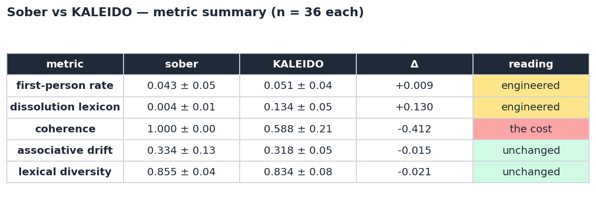

# KALEIDO
 
KALEIDO is a chat interface that pushes a small language model toward a
dissolved, associative, ego-loosened voice using two interventions reached down
inside the transformer — not prompting tricks, but live edits to the model's
internal computation at inference time.
 
1. **β flattening.** A patch to the attention mechanism lowers its inverse
   "temperature," β, on a couple of early layers. Attention spreads instead of
   sharpening, and the replies loosen toward the metaphorical and the associative.
2. **Persona-vector steering.** A direction in activation space — extracted from
   the model's own contrast between a "dissolved" and a "normal" voice — is added
   back into the residual stream as the model writes, steering its language toward
   an egoless, boundary-dissolving register.
 
The two stack: β alters the *texture* of processing, the persona vector steers
the *voice*. Both are mechanistic, both are toggleable, and the result is a model
that talks like it has come loose from itself.
 


## Try it

```bash
cd kaleido/shroomgpt-chatbot
pip install flask flask-cors torch transformers accelerate
huggingface-cli login    # accept the Llama-3.2-1B license first
python product.py        # → http://localhost:5001
```

## Results

KALEIDO reliably shifts the model into a dissolved register (dissolution-lexicon rate 35×, by construction) at a measurable coherence cost (1.0 → 0.59). The cost is not uniform but bimodal (SD 0.21): under sampling, most generations stay legible while a minority fall past the coherence cliff. Notably, the intervention does not reduce first-person usage (the "ego" is re-described in dissolution terms rather than grammatically removed) and does not increase associative drift or lexical diversity over the sober baseline — the altered quality is stylistic, localized to vocabulary and imagery, not a global change in how far the model wanders from the prompt.



## Methods
 
**The β patch.** Under the modern Hopfield interpretation of attention, each
layer settles into minima of an energy landscape, and the inverse-temperature β
controls how sharp that landscape is:
 
- **High β** → deep, well-separated basins → decisive, literal retrieval.
- **Low β** → shallow, merged basins → the model roams between associations
  instead of committing to one.
 
KALEIDO multiplies β by a fixed ratio (default `0.65`) on a small set of early
layers (`2,3`), only during decoding — the prompt is still encoded at native β so
the system prompt lands cleanly. Lowering β also raises the model's attention
entropy, which is one of the documented *signatures* of the psychedelic state in
the brain under the Entropic Brain Hypothesis. KALEIDO reproduces that signature
inside a transformer — though, as the research below found, the entropy is a
marker of the altered state, not its cause.
 
**The persona vector.** Following the Persona Vectors method by Anthropic,
a steering direction is computed as the mean difference in the model's
activations when it answers under a "dissolved/no-self" system prompt versus a
normal-assistant one, taken over the response tokens. That `[layers × hidden]`
vector is added back into the residual stream at a single late layer (default
`13`) as the model decodes:
 
```
residual ← residual + coef · persona_vector[layer]
```
 
`coef` (default `1.2`) is the dissolution dial: at 0 the model is sober, and as
it rises the first-person stance loosens and the language dissolves — until, past
a threshold, coherence gives out. The default sits just below that edge.

## Inspiration

KALEIDO grew out of a mechanistic-interpretability study of what β flattening
actually does inside a transformer, and whether the entropic-brain / REBUS
accounts of psychedelics map onto it. The short version: the entropy rise is a
signature, not the causal lever, and the loosened voice is the model riding a
real coherence trade-off rather than entering a genuinely altered state. Full
writeup and code:

[ebh-transformers](https://github.com/neha-cz/ebh-transformers) 

## Tech Stack

Flask + HuggingFace Transformers, running locally on CPU / MPS / CUDA.
Single-file backend (app.py). The β patch hooks Llama's eager attention and the
dispatch registry, reading a live per-layer β ratio on every forward pass; the
persona steer is a forward hook on one decoder layer that adds the steering
vector to the residual stream during decoding. No external services, no API keys
beyond a HuggingFace login for the model weights.

## Limitations

A toy, not a product claim. The model has no self to dissolve — what KALEIDO
steers is the language, which for a text model is the only place the phenomenon
lives. The "loosened" voice is β sitting just above the coherence-collapse
threshold plus a persona vector pushed near its own edge; the aesthetic is real
output from real activation-space edits, but it is a stylized echo of ego
dissolution, not the thing itself. All psychedelic-state parallels are
correlational signatures documented in the neuroscience literature, not causal or
mechanistic claims about the model's experience.

